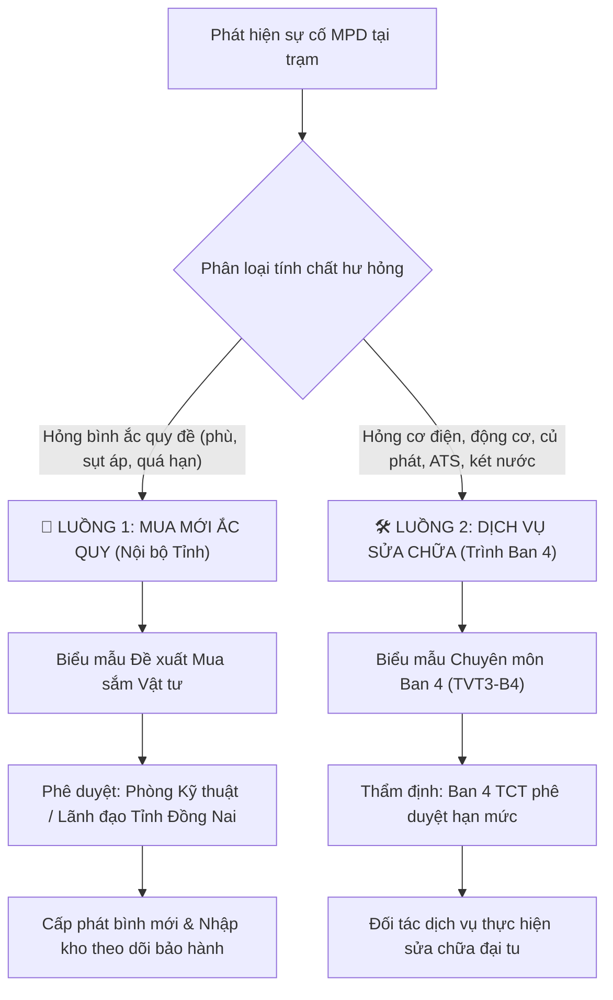

# 💡 BRIEF: Tách Luồng Đề Xuất Mua Mới Ắc Quy Đề & Đề Xuất Sửa Chữa MPD Trình Ban 4

**Ngày tạo:** 05/10/2026  
**Chủ đề:** Chuẩn hóa quy trình đề xuất khắc phục sự cố Máy Phát Điện (MPD) TVT3  
**Dựa trên chỉ đạo:** *Hỏng accu đề tách ra đề xuất mua riêng, hạng mục sửa chữa mới đề xuất Ban 4*

---

## 1. VẤN ĐỀ CẦN GIẢI QUYẾT (Pain Point)

| Thực trạng trước đây | Hậu quả / Bất cập |
|----------------------|-------------------|
| Gom chung tất cả các lỗi MPD (bao gồm cả hỏng bình ắc quy đề) vào chung danh mục "Đề xuất sửa chữa" trình Ban 4. | ❌ **Sai bản chất chi phí:** Bình ắc quy đề là **Vật tư tiêu hao thay thế**, không phải dịch vụ sửa chữa cơ điện. ❌ **Bị Ban 4 trả về / ách tắc:** Ban 4 thẩm định dịch vụ sửa chữa máy sẽ loại bỏ ắc quy hoặc yêu cầu tách gói, làm chậm tiến độ cấp điện dự phòng. ❌ **Khó theo dõi tồn kho & bảo hành:** Ắc quy mua mới có chế độ bảo hành riêng (12 tháng), cần theo dõi theo danh mục vật tư. |

---

## 2. GIẢI PHÁP ĐỀ XUẤT: PHÂN NHÁNH 2 LUỒNG ĐỘC LẬP

---

## 3. CHI TIẾT 2 NHÁNH QUY TRÌNH

### 🔋 Nhánh 1: Đề xuất Mua sắm Ắc quy đề (Nội bộ Tỉnh Đồng Nai)
* **Tính chất:** Mua sắm vật tư thay thế định kỳ / tiêu hao.
* **Tiêu chuẩn thông số cần thu thập:**
  * Dung lượng bình: `12V - 45Ah`, `12V - 70Ah`, `12V - 100Ah`, `12V - 120Ah` (tương ứng công suất máy 5kVA, 7.5kVA, 15kVA, 25kVA...).
  * Loại cọc: Cọc nổi / Cọc chìm, chủng loại (Khô kín khí / AGM).
  * Mã MPD, ID Trạm, Nhãn hiệu bình cũ, Năm đưa vào sử dụng.
  * Hiện trạng hỏng: *Bình bị phù, sụt áp dưới 10.5V khi đề, không ngậm điện sạc, nội trở cao*.
* **Đầu ra hồ sơ:** Bảng tổng hợp nhu cầu mua sắm ắc quy tập trung gửi Phòng Kỹ thuật & Hậu cần tỉnh duyệt mua lô.

---

### 🛠️ Nhánh 2: Đề xuất Sửa chữa MPD (Trình Ban 4 TCT)
* **Tính chất:** Dịch vụ sửa chữa, phục hồi, đại tu thiết bị tài sản cố định.
* **Biểu mẫu áp dụng:** Chuẩn 100% theo mẫu **`TVT3-B4. Biểu mẫu chuyên môn sua DHKK & MPD.xlsx`**.
* **Danh mục hạng mục sửa chữa chuẩn hóa (Không chứa ắc quy):**
  1. *Đại tu động cơ Diesel (thay bạc, séc măng, phốt dên, căn lốc)*.
  2. *Bảo dưỡng/cân chỉnh heo dầu bơm cao áp & béc phun nhiên liệu*.
  3. *Quấn lại cuộn dây Stator / Rotor đầu phát điện*.
  4. *Sửa chữa / thay thế bộ điều khiển tự động (ATS / Deepsea / DSE / Datakom)*.
  5. *Sửa chữa / hàn súc két nước giải nhiệt, thay van hằng nhiệt, ống dẫn*.
  6. *Thay củ đề khởi động / Dynamo nạp sạc (khi cuộn dây cháy hỏng)*.
  7. *Xử lý rò rỉ nhớt đáy cacte, thay gioăng quy lát*.
* **Đầu ra hồ sơ:** File Excel xuất đúng định dạng Sheet Ban 4, kèm hình ảnh hiện trạng và diễn giải chi tiết kỹ thuật.

---

## 4. THIẾT KẾ CẢI TIẾN GIAO DIỆN (UI/UX) TRÊN WEB

### 1. Form Báo Hỏng / Đề Xuất (Tự động thích ứng thông minh)
* Ngay tại màn hình Báo hỏng MPD:
  * Người dùng chọn **Loại đề xuất**:
    * 🔘 `🔋 Đề xuất Mua mới Ắc quy đề (Mua sắm vật tư)`
    * 🔘 `🛠️ Đề xuất Sửa chữa MPD (Hồ sơ trình Ban 4)`
* **Khi chọn `Ắc quy đề`:**
  * Form tự động thu gọn tối đa: Chỉ cần chọn Dung lượng bình (`45Ah`, `70Ah`, `100Ah`...), tình trạng bình cũ và upload 1 ảnh chụp cọc/thông số bình.
* **Khi chọn `Sửa chữa Ban 4`:**
  * Form hiển thị đúng các trường chuyên môn Ban 4 yêu cầu: Hạng mục chuẩn hóa dropdown, Nội dung hỏng chi tiết, Đơn vị đề xuất, Mức độ ưu tiên.

### 2. Danh sách Quản lý & Lọc linh hoạt
* Bổ sung **Tab chuyển đổi 1-chạm** trên giao diện:
  * 📋 **Tất cả đề xuất**
  * 🔋 **Đề xuất Mua Ắc quy** *(Gom danh sách gửi Phòng KT duyệt mua)*
  * 🛠️ **Đề xuất Sửa chữa Ban 4** *(Theo dõi tiến độ trình ký Ban 4)*
* Nút xuất báo cáo:
  * 📥 **Xuất Biểu mẫu Ban 4 (Excel)**: Tự động lọc chỉ lấy các ca sửa chữa, tuyệt đối không lẫn bình ắc quy.
  * 📥 **Xuất Danh sách Mua Ắc quy (Excel)**: Tổng hợp theo chủng loại bình để phòng Hậu cần đi chào giá mua sắm.

---

## 5. BƯỚC TIẾP THEO

1. **Chuyển sang `/plan`**: Lên kế hoạch kỹ thuật chi tiết (sửa schema database Supabase, cập nhật giao diện `DailyWork.jsx` / `Generator.jsx` và hàm xuất Excel).
2. **Triển khai `/code`**: Thực thi code và deploy kiểm thử ngay cho anh em vận hành.
