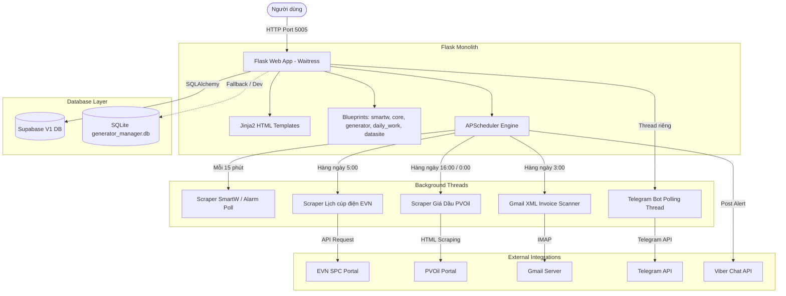

# 🏥 BÁO CÁO AUDIT HỆ THỐNG V1 (CURRENT_STATE.md)

**Ngày tạo:** 2026-06-16  
**Người thực hiện:** Chief Architect Agent & Antigravity  
**Phiên bản hệ thống được audit:** TVT3 Legacy (web-app)

---

## 1. Tổng quan Kiến trúc V1

Hệ thống TVT3 V1 hoạt động dưới dạng **Monolith truyền thống** kết hợp server-side rendering (Flask + Jinja2 Templates) phục vụ giao diện người dùng, đồng thời gánh luôn cả vai trò chạy tác vụ ngầm (Background Scrapers, Viber Alerts, Telegram Bot).

---

## 2. Thống kê Dữ liệu & Database V1

Cơ sở dữ liệu V1 bao gồm **30 bảng** lớn nhỏ trên PostgreSQL (Supabase V1). Cụ thể:
- Bảng nghiệp vụ cốt lõi: `general_info` (391 trạm), `power_schedule` (864 lịch cúp), `generator_log` (4397 nhật ký chạy máy), `fuel_ledger` (189 giao dịch nhiên liệu), `other_expense` (93 chi phí khác), `daily_work` (1385 nhật ký công việc), `station_issue` (77 lỗi hạ tầng).
- Bảng đồng bộ từ Excel (DataSite): `ds_stations` (396 trạm), `ds_contracts` (361 hợp đồng), `ds_infrastructure` (1109 hạ tầng), `ds_equipments` (2706 thiết bị), `ds_telecom` (7867 thiết bị vô tuyến/RAN), `ds_transmissions` (368 tuyến cáp quang/truyền dẫn), `ds_site_registry` (389 đăng ký trạm), `ds_cell_registry` (2722 cell anten).
- Bảng tiện ích & legacy: `fuel_refill_log`, `fuel_purchase_log`, `fuel_transaction`, `parsed_invoice` (25 hóa đơn XML), `system_config`, `deletion_request`.

---

## 3. Đánh giá Chi tiết (Strengths & Weaknesses)

### 3.1. Strengths (Điểm mạnh)
1. **Đáp ứng đầy đủ nghiệp vụ:** Hệ thống giải quyết tốt bài toán quản lý cúp điện, đối soát nhiên liệu, nhật ký chạy máy phát điện, kiểm tra định mức tiêu hao và theo dõi công việc của Tổ Viễn Thông 3.
2. **Tự động hóa tốt:** Các bộ scraper tự động chạy ngầm giúp giảm 90% công việc nhập liệu tay (tự quét lịch cúp điện từ EVN SPC, tự cào giá dầu PVOil trước thuế, tự đồng bộ máy phát điện chạy từ SmartW).
3. **Trích xuất thông minh:** Bộ quét hóa đơn điện tử tự động đọc email Gmail, tải XML và phân tích (parse) tự động số lượng, đơn giá xăng dầu và đẩy vào DB đối soát.
4. **Hệ thống Alerts đa kênh:** Báo cáo cúp điện và sự cố hoạt động trơn tru qua Viber Chat API và Telegram Bot.

### 3.2. Weaknesses (Điểm yếu)
1. **Kiến trúc Monolithic Coupling:** Web UI và Background Workers chạy chung một tiến trình Flask. Khi scraper cào dữ liệu lớn hoặc Gmail quét IMAP chậm, nó làm nghẽn Event Loop khiến UI bị gián đoạn hoặc bị crash.
2. **Cơ sở dữ liệu bùng nổ, phân mảnh:** Sử dụng 30 bảng phẳng SQL dẫn đến việc bảo trì và nâng cấp cấu trúc cực kỳ khó khăn. Thay đổi thông số một thiết bị (VD: nâng cấp máy phát điện từ 6KVA lên 10KVA) đòi hỏi phải thay đổi cấu trúc bảng hoặc thêm nhiều cột rỗng.
3. **Giao diện lỗi thời (Server-side rendering):** Sử dụng HTML/Jinja2 + Bootstrap truyền thống. Mỗi lần chuyển tab hoặc tìm kiếm phải load lại trang, không mang lại cảm giác mượt mà và khó sử dụng trên thiết bị di động (mobile) của kỹ thuật viên đi tuyến.
4. **Không có cơ chế Realtime:** Khi có cảnh báo mất điện mới từ SmartW, người dùng phải F5/tải lại trang thủ công để nhìn thấy thay đổi trên Dashboard.

---

## 4. Phân tích Rủi ro & Nợ kỹ thuật

### 4.1. Technical Debt (Nợ kỹ thuật)
- **Định dạng dữ liệu không đồng nhất:** Cột ngày tháng (`date`/`ngay`) được lưu dưới nhiều kiểu: một số bảng lưu String định dạng `%Y-%m-%d`, một số là `%d/%m/%Y`, một số là ISO Timestamp (`%Y-%m-%dT%H:%M:%S`). Điều này gây ra nhiều lỗi logic khi viết query đối soát, tính toán báo cáo tổng hợp.
- **Bảng Legacy dư thừa:** Nhiều bảng di sản từ các phiên bản cũ (`fuel_refill_log`, `fuel_purchase_log`, `fuel_transaction`) không còn được sử dụng trong mã nguồn hiện tại nhưng vẫn tồn tại trong Database làm tăng sự hỗn loạn.
- **Lặp code Scraper:** Logic trích xuất và format dữ liệu trạm bị lặp lại nhiều lần giữa `datasite_scraper.py`, `datasite_utils.py` và các script chuyển giao.

### 4.2. Security Risks (Rủi ro bảo mật)
1. > [!CRITICAL]
   > **Vô hiệu hóa Row Level Security (RLS):** Toàn bộ 30 bảng trên Supabase V1 đều bị tắt RLS (`rls_enabled = false`). Bất kỳ ai có mã `anon_key` đều có thể đọc/ghi/xóa toàn bộ cơ sở dữ liệu hệ thống mà không cần thông qua xác thực của Flask App.
2. **Lưu trữ Secrets trong Source Code:** Các API Token (Viber Token, Telegram Bot Token) bị hardcode trực tiếp hoặc lưu rải rác trong file mã nguồn thay vì quản lý tập trung ở biến môi trường hoặc Vault bảo mật.
3. **Mật khẩu quản trị mặc định:** Việc tự động tạo user `admin` với mật khẩu mặc định `admin123` nếu thiếu cấu hình `.env` rất nguy hiểm khi deploy production.

### 4.3. Performance Bottlenecks (Nút thắt hiệu năng)
- **Waitress blocked by Scrapers:** Waitress WSGI server chỉ xử lý đồng thời số lượng luồng giới hạn. Việc scraper chạy đồng bộ (Synchronous Requests) cào EVN SPC (30 mã KH/batch) chiếm dụng luồng phục vụ người dùng.
- **Query Báo cáo nặng:** Báo cáo "Tổng hợp theo trạm" thực hiện nhiều phép JOIN và tính toán định mức thời gian chạy máy (Calculated Fields) trực tiếp khi người dùng mở trang quản trị mà không có caching hay tối ưu hóa index, gây ra độ trễ (latency) lớn khi dữ liệu tăng dần.
