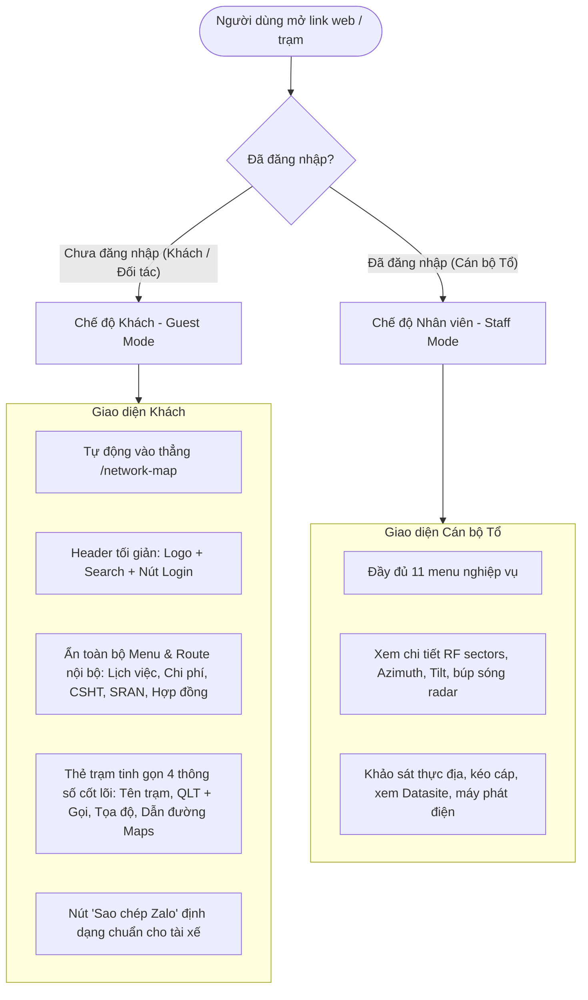

# 🎨 DESIGN: BẢN ĐỒ SỐ BTS CHO ĐỐI TÁC & GIAO NHẬN (GUEST MODE)

**Ngày tạo:** 03/10/2026  
**Dự án:** TVT3 - Bản đồ Số Trạm BTS (MobiFone Đồng Nai)  
**Mục tiêu:** Tối ưu hóa trải nghiệm khách vãng lai / đối tác giao nhận hàng hóa, đội thi công lắp đặt và kỹ thuật viên cần liên hệ ra vào trạm; loại bỏ cản trở giao diện và bảo vệ thông tin nội bộ của đơn vị.

---

## 1. Kiến Trúc Phân Quyền & Luồng Dữ Liệu (Guest vs Staff)



---

## 2. Danh Sách Màn Hình & Thành Phần Giao Diện

| # | Thành phần | Trạng thái Khách (Guest) | Trạng thái Nội bộ (Staff) |
|---|---|---|---|
| 1 | **Cookie Banner** | ❌ Gỡ bỏ vĩnh viễn | ❌ Gỡ bỏ vĩnh viễn |
| 2 | **Header Navigation** | Ẩn toàn bộ 11 menu, chỉ còn: Logo TVT3, Tìm kiếm trạm, nút "Đăng nhập" | Đầy đủ 11 menu chức năng nghiệp vụ |
| 3 | **Trang chủ (`/`)** | Tự động chuyển hướng sang `/network-map` | Mở Dashboard điều hành của Tổ |
| 4 | **Bản đồ (`/network-map`)** | Hiển thị trạm hoạt động & tìm kiếm nhanh | Hiển thị trạm, quy hoạch, tuyến cáp, búp sóng cell |
| 5 | **Thẻ trạm Desktop Popup** | Rút gọn 4 thông tin + Dẫn đường + Nút Zalo | Đầy đủ thông tin RF, cells, QLT, vùng phủ, Datasite |
| 6 | **Thẻ trạm Mobile Drawer** | Light Mode, 4 thông tin + Dẫn đường + Nút Zalo | Đầy đủ công cụ khảo sát, kéo cáp, sao chép |
| 7 | **Các route nội bộ (`/datasites`, `/expenses`,...)** | 🔒 Chặn truy cập (chuyển hướng về `/login`) | Cho phép truy cập bình thường |

---

## 3. Thiết Kế Chi Tiết: Thẻ Trạm Tinh Gọn Cho Khách

### 3.1. Cấu trúc hiển thị chuẩn (Desktop Popup & Mobile Bottom Sheet)
* **Tiêu đề trạm:**
  * Mã cũ - Mã mới: `DNDQ31 - DNILNA05`
  * Tên trạm: `Long An 5`
* **Nút Dẫn đường chính:**
  * Button Gradient Xanh nổi bật: `🚗 Dẫn đường Google Maps`
  * Link: `https://www.google.com/maps/dir/?api=1&destination={lat},{lng}&travelmode=driving` (Mở ứng dụng Google Maps trực tiếp chỉ đường lái xe).
* **Khối Quản Lý Trạm (QLT):**
  * Tên người QLT: `Lê Văn Tân`
  * Nút Gọi điện thoại: `📞 Gọi 0787222345` (màu xanh lá tươi, bấm tự động gọi).
* **Khối Tọa độ GPS:**
  * Tọa độ dạng số thập phân: `11.157100, 107.245100` kèm nút `📋 Copy`.
* **Nút hành động "Sao chép tin nhắn Zalo":**
  * Nút màu trắng viền xám sáng, icon Zalo/Share.
  * Khi bấm, tự động copy vào Clipboard theo format chuẩn:
    ```text
    Trạm: {Mã trạm cũ} - {Mã trạm mới}
    Người QLT: {Tên QLT} - {SĐT QLT}
    Tọa độ: {Vĩ độ}, {Kinh độ}
    Chỉ đường: https://www.google.com/maps/dir/?api=1&destination={lat},{lng}
    ```

---

## 4. Hành Trình Người Dùng (User Journey)

### 📍 HÀNH TRÌNH 1: Tài xế / Đối tác mở link từ Zalo
1. Tài xế nhận tin nhắn Zalo có link: `https://tvt3.vercel.app/network-map?search=DNDQ31`
2. Bấm vào link:
   - Web mở ngay lập tức (không có popup cookie cản trở).
   - Bản đồ tự động định vị tới trạm `DNDQ31`.
   - Bottom Sheet trạm tự động trượt lên màn hình với 4 thông tin cốt lõi.
3. Tài xế bấm **"Dẫn đường"** ➔ Google Maps mở ra dẫn đường lái xe đến trạm.
4. Khi đến gần trạm, tài xế bấm **"Gọi 0787222345"** ➔ Gọi ngay cho đồng chí QLT để mở cửa trạm / tiếp nhận hàng.

### 📍 HÀNH TRÌNH 2: Cán bộ Tổ điều phối đối tác
1. Cán bộ mở bản đồ trên điện thoại / máy tính, gõ tìm trạm `DNDQ31`.
2. Bấm vào trạm ➔ Bấm nút **"Sao chép thông tin"**.
3. Mở Zalo dán ngay cho nhà xe hoặc đơn vị thi công (không cần gõ tay lại số điện thoại hay link tọa độ).

---

## 5. Kế Hoạch Kiểm Thử (Acceptance Criteria & Test Cases)

### Checklist Nghiệm Thu:
- [ ] **AC-01 (Cookie):** Không còn bất kỳ popup "Bảo mật & Cookie vận hành" nào hiển thị.
- [ ] **AC-02 (Guest Header):** Khi chưa đăng nhập, Header không hiển thị danh sách 11 menu nội bộ; chỉ hiển thị Logo, ô tìm kiếm và nút "Đăng nhập".
- [ ] **AC-03 (Guest Navigation):** Khách gõ `https://tvt3.vercel.app/` tự động vào thẳng `/network-map`.
- [ ] **AC-04 (Guest Station Card):** Khi khách click vào trạm, chỉ hiển thị đúng 4 thông tin: Tên trạm, QLT (kèm gọi), Tọa độ (kèm copy), Chỉ đường Google Maps.
- [ ] **AC-05 (Zalo Format):** Bấm nút sao chép tạo ra đúng định dạng tin nhắn mẫu.
- [ ] **AC-06 (Staff Retention):** Khi đăng nhập, cán bộ Tổ vẫn sử dụng đầy đủ các tính năng kỹ thuật nâng cao.

---
*Tạo bởi AWF Workflow: /design*
