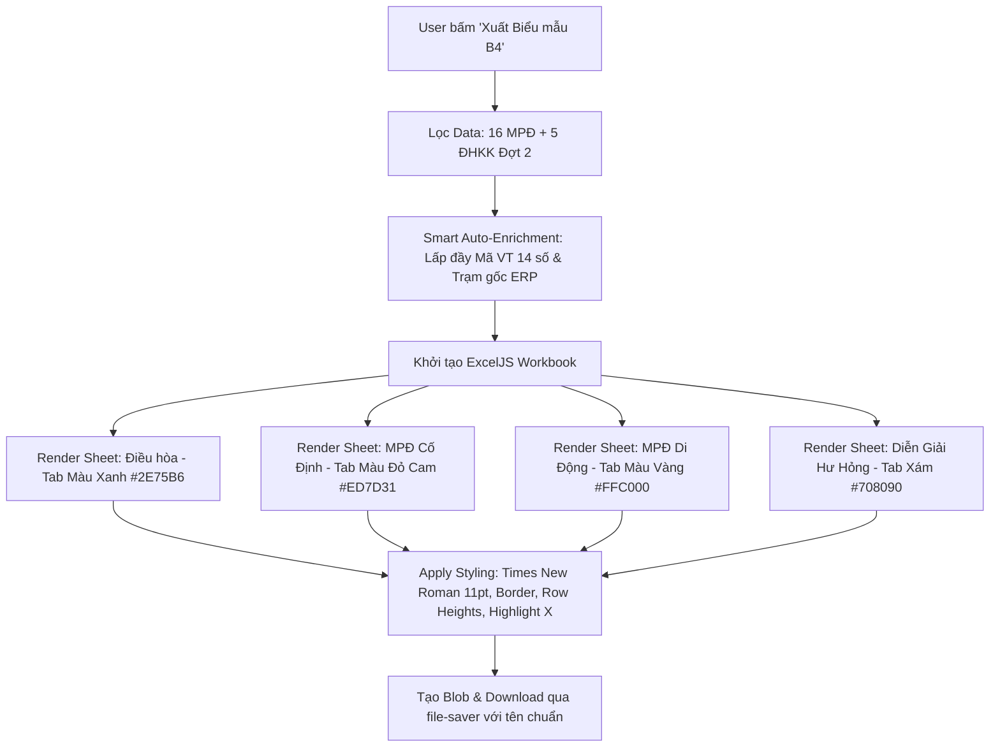

# 🎨 TÀI LIỆU THIẾT KẾ: NÂNG TẦM TRÌNH BÀY & STYLING BIỂU MẪU B4 (EXCELJS EXECUTIVE TEMPLATE)

**Mã thiết kế:** `261005-DESIGN-B4-EXCEL-STYLING`  
**Ngày lập:** 05/10/2026  
**Dự án:** Antigravity TVT3  
**Dựa trên:** [BRIEF_STATION_EQUIPMENT_CODE_AUDIT.md](file:///Users/cang_it/Antigravity/TVT3/docs/BRIEF_STATION_EQUIPMENT_CODE_AUDIT.md) & Feedback của User về thẩm mỹ xuất file  
**Công nghệ:** `ExcelJS` v4.4.0 + `file-saver` (Thay thế hoàn toàn SheetJS plain text)  

---

## 1. VẤN ĐỀ THẨM MỸ CỦA FILE XUẤT HIỆN TẠI

| Tiêu chí | Hiện trạng (SheetJS CE) | Vấn đề / Khuyết điểm |
|---|---|---|
| **Font chữ** | Calibri 11pt mặc định của Excel | Không đồng bộ với chuẩn văn bản hành chính MobiFone (Nghị định 30/2020/NĐ-CP yêu cầu Times New Roman). |
| **Tiêu đề bảng (Header)** | Chữ trơn, không màu nền, không viền đậm | Nhìn đơn điệu, dễ lẫn lộn giữa dòng tiêu đề và dòng dữ liệu khi cuộn chuột. |
| **Độ cao dòng (Row Height)** | Tự động mặc định (~15pt) | Các ô có nhiều chữ (Mô tả hư hỏng, Tiêu đề dài) bị co cụm, dính sát viền mép, rất khó đọc. |
| **Căn lề (Alignment)** | Căn tự động (Số lệch phải, Chữ lệch trái) | Mã trạm, Mã VT 14 số, Serial, Ngày tháng bị căn lệch lung tung, không ngay ngắn ở giữa ô. |
| **Dấu chọn hạng mục (`X`)** | Chữ `X` thường màu đen xám | Nhìn vào ma trận 11 cột rất khó nhận biết máy đang hỏng mục nào (Đầu phát, ATS hay Động cơ). |
| **Màu sắc Tab Sheet** | Màu trắng xám mặc định | Khó phân biệt nhanh giữa MPĐ Cố Định, Di Động, ĐHKK và Bảng Diễn giải. |

---

## 2. HỆ THỐNG THIẾT KẾ MỚI (EXECUTIVE DESIGN SYSTEM FOR EXCEL)

### 2.1. Quy Chuẩn Typography (Phông Chữ Chuẩn TCT)
- **Font Family:** `Times New Roman` (100% toàn bộ Workbook).
- **Phân cấp kích thước (Hierarchy):**
  - **Header 1 (Tên cột):** `11pt`, **Bold**, Canh giữa (`horizontal: center, vertical: middle`), `wrapText: true`.
  - **Header 2 (Chỉ mục cột):** `10pt`, **Bold & Italic**, Canh giữa.
  - **Data Cells (Dữ liệu):** `11pt`, Regular. Riêng **Mã trạm** in đậm (**Bold**).
  - **Dấu Hạng mục Hư hỏng (`X`):** `12pt`, **Bold**, Màu Đỏ MobiFone (`#C00000`) hoặc Xanh đậm (`#1F497D`).

### 2.2. Bảng Phối Màu (Color Palette Chuẩn Doanh Nghiệp)
- **Màu Chủ Đạo (Primary Brand):** Xanh Navy MobiFone `#1F497D`.
- **Màu Nền Header:**
  - Cột thông tin thiết bị (Cột 1 đến 15): Nền Xanh Băng thanh lịch `#D9E1F2` hoặc Trắng Tinh tế viền đôi.
  - Cột hạng mục hư hỏng (Cột 16 đến 26): Nền Vàng Cam Nhạt `#FCE4D6` để phân biệt rõ khối kỹ thuật.
- **Màu Nổi Bật Dấu `X` (Active Defect Badge):**
  - Khi một ô có dấu `X`: Nền ô tự động chuyển sang màu Vàng Nắng Nhạt `#FFF2CC`, chữ `X` màu Đỏ Cảnh Báo `#C00000` $\longrightarrow$ **Lãnh đạo hoặc Ban 4 liếc mắt qua là thấy ngay trạm hỏng hạng mục gì!**
- **Màu Tab Sheet:**
  - Sheet `Điều hòa`: Xanh Ngọc `#2E75B6`
  - Sheet `Máy phát điện_Cố định`: Đỏ Cam `#ED7D31`
  - Sheet `Máy phát điện_Di động`: Vàng Kim `#FFC000`
  - Sheet `Diễn giải DM hỏng tham chiếu`: Xám Bạc `#708090`

### 2.3. Quy Chuẩn Căn Lề & Canh Chỉnh Ô (Alignment & Formatting)
- **STT, Tỉnh, Mã ERP Trạm, Phân loại:** Canh giữa (`center`), Canh giữa dòng (`middle`).
- **Mã Thiết Bị / Vật Tư (14 số):** Canh giữa (`center`), Định dạng chuỗi Text `@` (bảo toàn số `0` ở đầu).
- **Mã Tài Sản / Mã CCDC (15 số):** Canh giữa (`center`).
- **Số Serial:** Canh giữa (`center`).
- **Thời gian đưa vào SD:** Canh giữa (`center`).
- **Hãng sản xuất & Công suất:** Canh giữa (`center`).
- **Công cụ quản lý & Lịch sử sửa chữa:** Canh giữa (`center`).
- **Mô tả hiện trạng hư hỏng:** Canh trái (`left`), Canh giữa dòng (`middle`), `wrapText: true` (Tự động xuống dòng mềm mại).
- **Chi phí dự kiến:** Canh phải (`right`), Định dạng tiền tệ `#,##0`.

### 2.4. Khung Viền & Khoảng Cách Dòng (Borders & Dimensions)
- **Border:**
  - Viền ô dữ liệu: Mảnh (`thin`), màu ghi tối `#595959` hoặc đen `#000000`.
  - Viền ngăn cách Header và Data: Đường viền trung bình (`medium`).
- **Chiều cao dòng (Row Heights):**
  - Dòng 1 (Header cột): `68pt` (Thoải mái cho tiêu đề 3-4 dòng không bị cắt chữ).
  - Dòng 2 (Chỉ mục `(1)...(26)`): `22pt`.
  - Dòng dữ liệu (Data rows): `30pt` (Khoáng đạt, thẩm mỹ, sang trọng).

---

## 3. MOCKUP TRỰC QUAN SO SÁNH (BEFORE VS AFTER)

```
TRƯỚC ĐÂY (SheetJS CE - Chữ trơn, lệch lạc, vô hồn):
-----------------------------------------------------------------------------------------
STT | Tinh     | Ma ERP  | Phan loai | Ma VT          | Ma TS           | Mo ta     | 1 | 2 | 3
1   | Dong Nai | DNTN26  | TSCD      | 00021588100001 | 2027B1500000279 | May hu bo |   | X |  
-----------------------------------------------------------------------------------------

SAU KHI THIẾT KẾ MỚI (ExcelJS Executive - Times New Roman, Header Phối Màu, Badge Đỏ Nổi Bật):
=========================================================================================
 🏛️ BIỂU MẪU B4 - ĐỀ XUẤT SỬA CHỮA MÁY PHÁT ĐIỆN & ĐIỀU HÒA (BAN 4 MOBIFONE)
-----------------------------------------------------------------------------------------
[STT] | [Tỉnh]    | [Mã ERP] | [Phân loại] | [Mã VT (14 số)] | [Mô tả hư hỏng]     | [Đầu phát]
 (1)  |   (2)     |   (3)    |     (4)     |       (6)       |       (14)          |   (17)   
-----------------------------------------------------------------------------------------
  1   |  Đồng Nai |  DNTN26  |    TSCĐ     | 00021588100001  | Máy hư bo AVR, mất  |   [ ❌ ]  
      |  (Giữa)   |  (Bold)  |   (Giữa)    | (Text chuẩn 14) | điện áp đầu phát... | (Nền Vàng)
-----------------------------------------------------------------------------------------
  2   |  Đồng Nai |  DNTP34  |    TSCĐ     | 00020491100001  | Hư sạc, curoa chùng |   [ ❌ ]  
      |  (Giữa)   |  (Bold)  |   (Giữa)    | (Auto-Enrich)   | nhão tăng hết cỡ... | (Mục 3 DC)
=========================================================================================
```

---

## 4. SƠ ĐỒ LUỒNG THỰC THI MÃ NGUỒN (DATA FLOW)



---

## 5. TIÊU CHÍ NGHIỆM THU (ACCEPTANCE CRITERIA)

1. **Font chữ:** Mở file trên Microsoft Excel và WPS Office hiển thị 100% chuẩn `Times New Roman`.
2. **Tiêu đề:** Header có màu nền xanh nhạt chuyên nghiệp, viền sắc nét, tiêu đề dài tự xuống dòng đẹp mắt.
3. **Căn lề:** Toàn bộ cột mã và số liệu căn giữa ngay ngắn; cột mô tả hư hỏng căn trái và tự động wrapText.
4. **Hạng mục hỏng:** Các ô có đánh dấu `X` tự động có nền vàng ấm và chữ đỏ đậm, nổi bật ngay lập tức.
5. **Dung lượng & Tốc độ:** Xuất file nhanh dưới 1.5 giây, file mở không bị cảnh báo lỗi định dạng của Excel.
