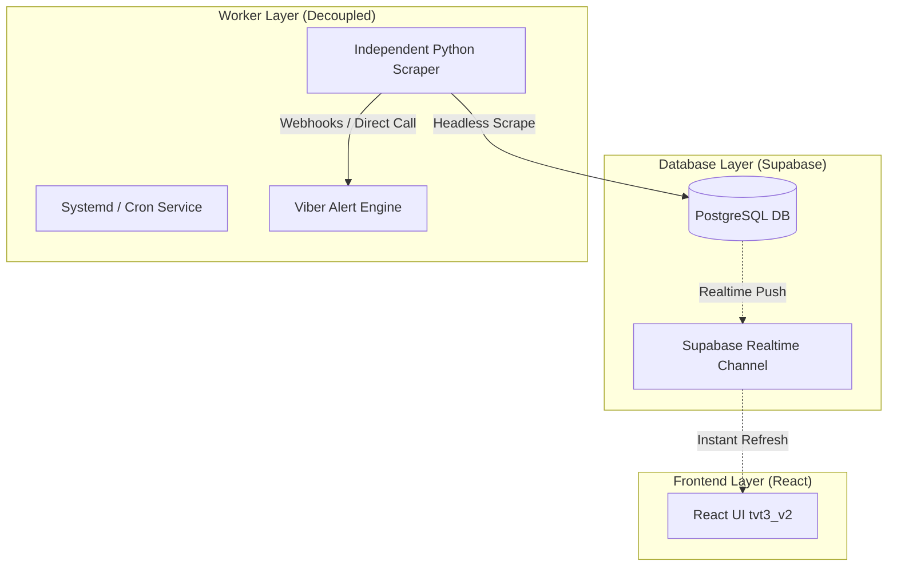

# 📊 BÁO CÁO REVIEW VÀ BRIEF THIẾT KẾ SMARTW V2

**Dự án:** TVT3 Quản Lý Vận Hành
**Phiên bản:** TVT3 v2 (React + Supabase + Decoupled Worker)
**Ngày thực hiện:** 28/05/2026
**Thực hiện bởi:** Antigravity AI Partner (AWF v4.0.2)

---

## 🔍 PHẦN 1: REVIEW - ĐÁNH GIÁ SỨC KHỎE V1 (SmartW cũ)

Hệ thống giám sát SmartW V1 đang chạy tích hợp trong thư mục `web-app/smartw` (Python Flask Monolith). Qua rà soát mã nguồn thực tế, em phát hiện các lỗi nghiêm trọng khiến hệ thống V1 thường xuyên bị treo và hoạt động không ổn định:

### 1. Lỗi Đăng Nhập SSO (SSO Redirect & Lockout)
*   **Vấn đề:** Trang đăng nhập SSO của Mobifone (`auth-sso2fa.mobifone.vn:8080`) liên tục thay đổi chính sách bảo mật, cấu trúc DOM và cơ chế chuyển hướng.
*   **Hậu quả:** Playwright chạy headless không điền được mật khẩu hoặc click sai nút Đăng nhập -> kích hoạt cơ chế **Circuit Breaker** khóa tài khoản tạm thời (`login_fail_count >= 10`) để tránh bị nhà mạng khóa vĩnh viễn -> hệ thống dừng cào hoàn toàn.

### 2. Trình Duyệt Playwright Bị Treo (Stale Browser / Thread Leaks)
*   **Vấn đề:** Sử dụng luồng chạy ngầm của Flask (`threading.Thread`) trực tiếp trong `routes.py` để manual trigger:
    ```python
    t = threading.Thread(target=_run_both, daemon=True)
    t.start()
    ```
*   **Hậu quả:** Khi Playwright gặp lỗi crash (ví dụ: `NoneType has no attribute send` hoặc `Target page closed`), các tiến trình con Chromium không được giải phóng triệt để. Việc Flask sinh Thread tự do mà không có cơ chế quản lý Queue (nhu cầu Celery/Redis) gây rò rỉ bộ nhớ (memory leak), dẫn tới sập toàn bộ Web Server Flask.

### 3. Bộ Parser jqxGrid Quá Mong Manh (Brittle Selector)
*   **Vấn đề:** Giao diện SmartW hiển thị danh sách cảnh báo dưới dạng widget jqxGrid (toàn các thẻ `div` lồng nhau chứ không phải thẻ `<table>` truyền thống).
*   **Hậu quả:** Chỉ cần nhà mạng cập nhật nhẹ CSS hoặc tên class thẻ `div`, bộ quét DOM bằng Javascript trong `scraper.py` (`#contenttablejqxgrid div[role="row"]`) lập tức bị vỡ, không phân tích được dữ liệu.

---

## 💡 PHẦN 2: BRAINSTORM - GIẢI PHÁP THIẾT KẾ V2

Chìa khóa để khắc phục triệt để lỗi của V1 là áp dụng **Triết lý Thiết kế Kiến trúc V2 (Decoupled Services)**: tách biệt hoàn toàn phần giao diện (UI) và phần quét ngầm (Worker).



### 1. Database Layer: Chuyển dữ liệu lên Supabase PostgreSQL
*   Tạo bảng `smartw_alarms` trên Supabase PostgreSQL để lưu trữ cảnh báo thay vì ghi file JSON cục bộ (`md.json`, `mpd.json`) trên server.
*   Bật tính năng **Supabase Realtime** cho bảng này.

### 2. Frontend Layer: React UI (`tvt3_v2`) Realtime
*   React UI kết nối trực tiếp với Supabase qua API của client.
*   Sử dụng **Supabase Subscription** lắng nghe thay đổi của bảng `smartw_alarms`. Khi có cảnh báo mới hoặc cảnh báo được xóa, UI lập tức tự động cập nhật trong tích tắc mà **không cần người dùng tải lại trang (Zero-Refresh)**.

### 3. Worker Layer: Tách biệt thành Dịch Vụ Độc Lập (Decoupled Worker)
*   Chuyển mã nguồn scraper từ Flask Blueprint thành một **Python Daemon Script độc lập**.
*   **Không chạy chung luồng với Web Server nữa.** Con worker này sẽ được cấu hình chạy bằng `systemd` dịch vụ của hệ điều hành Linux hoặc `crontab` định kỳ 5-15 phút.
*   Nếu worker có bị crash hoặc bị khóa SSO, nó chỉ ghi log lỗi lên Supabase chứ **hoàn toàn không làm ảnh hưởng hay sập trang giao diện web**.

### 4. Nâng Cấp Scraper Playwright (Chống Lockout & Bypass SSO)
*   **Session Caching:** Thay vì đăng nhập lại mỗi chu kỳ, ta sẽ lưu Cookies/Session của SSO vào bảng cấu hình Supabase. Scraper chỉ cần tải cookies này lên để bypass trang đăng nhập, nâng tuổi thọ session lên tối đa.
*   **API Fast Fetch:** Tận dụng tối đa phương thức gọi API ngầm (`fetch`) trực tiếp bằng Session Cookies đã lưu để lấy dữ liệu dạng JSON thô từ SmartW, giảm thiểu tối đa việc phải render giao diện Chromium giả lập, giúp tăng tốc độ cào gấp 10 lần và tiết kiệm RAM VPS.

---

## 📋 PHẦN 3: KẾ HOẠCH DI TRÚ SMARTW LÊN V2 (MIGRATION PLAN)

### 🚀 Giai đoạn 1: Thiết Kế Schema Database (Supabase)
*   **Bảng `smartw_alarms`**:
    *   `id` (uuid, PK)
    *   `site_id` (text) - Mã trạm (DNISRA00)
    *   `alarm_name` (text) - Tên cảnh báo (Mất điện AC, Chạy máy phát, Mất liên lạc...)
    *   `alarm_type` (text) - Phân loại: `MD` (Mất điện), `MPD` (Máy phát), `MLL` (Mất liên lạc), `MLL_CELL` (Mất liên lạc cell)
    *   `severity` (text) - Mức độ nghiêm trọng
    *   `sdate` (timestamp with time zone) - Thời điểm xuất hiện cảnh báo
    *   `edate` (timestamp with time zone, nullable) - Thời điểm kết thúc cảnh báo
    *   `status` (text) - Trạng thái: `ACTIVE` / `CLEARED`
    *   `created_at` (timestamp)
*   **Bảng `smartw_configs`**: Lưu trữ tài khoản mã hóa và cookies session.

### 💻 Giai đoạn 2: Phát Triển Dịch Vụ Worker Mới
*   Viết file `scripts/smartw_worker_v2.py`:
    *   Tự động đọc cấu hình từ Supabase.
    *   Thực hiện đăng nhập SSO qua Playwright (chỉ chạy khi cookies hết hạn).
    *   Quét dữ liệu thô và đồng bộ thẳng (Upsert) vào bảng `smartw_alarms` của Supabase.
    *   Tích hợp sẵn Viber Alert Engine gửi thông báo khi có dòng dữ liệu thay đổi trạng thái (Fired/Cleared).

### 🎨 Giai đoạn 3: Xây Dựng Giao Diện React
*   Tạo trang `tvt3_v2/src/pages/SmartWDashboard.jsx` hiển thị 4 bảng: Mất điện, Máy phát, Mất liên lạc, Lịch cúp điện.
*   Tích hợp badge trạng thái kết nối realtime.

---

## ⚠️ CÁC RỦI RO & PHƯƠNG ÁN PHÒNG VỆ
1.  **Rủi ro tài khoản SSO bị khóa (Lockout):**
    *   *Phòng vệ:* Khi gặp 3 lỗi đăng nhập liên tiếp, Worker phải dừng hoạt động ngay lập tức và gửi cảnh báo khẩn cấp qua Viber để admin kiểm tra thủ công, tuyệt đối không cố đăng nhập tiếp.
2.  **Độ trễ dữ liệu giữa các luồng quét:**
    *   *Phòng vệ:* Tận dụng cơ chế Upsert của Supabase dựa trên khóa duy nhất: `site_id + alarm_name + sdate` để tránh bị trùng lặp dữ liệu khi chạy quét đồng thời.

---

## 🚀 HƯỚNG ĐI TIẾP THEO (NEXT STEPS)

*   **1️⃣ Bắt đầu khởi tạo cấu trúc bảng `smartw_alarms` trên Supabase?** 👉 Gõ `/design` hoặc `/code`
*   **2️⃣ Viết lại script Scraper Playwright độc lập bypass SSO?** 👉 Gõ `/code`
*   **3️⃣ Phác thảo mockup UI giám sát Realtime trên React?** 👉 Gõ `/visualize`
