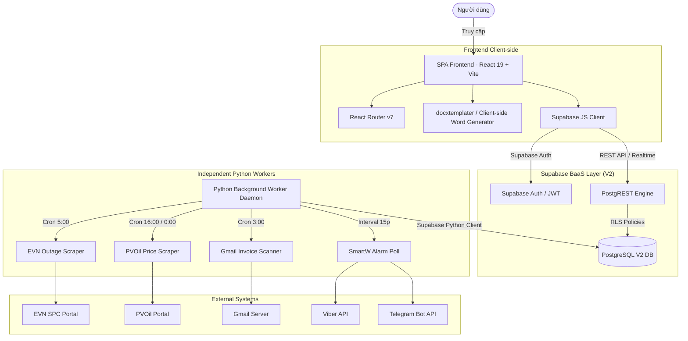

# 🎨 THIẾT KẾ KIẾN TRÚC V2 (TARGET_ARCHITECTURE.md)

**Ngày tạo:** 2026-06-16  
**Người thực hiện:** Chief Architect Agent & Antigravity  
**Trạng thái thiết kế:** Được phê duyệt (Approved)

---

## 1. Triết Lý Thiết Kế Hệ Thống V2

Hệ thống TVT3 V2 chuyển dịch sang kiến trúc **Decoupled Modern Web App (SPA + BaaS + Workers)**. 



### Các điểm mấu chốt:
1. **Chia tách hoàn toàn Frontend & Backend:** UI được chạy trực tiếp trên trình duyệt người dùng, kết nối trực tiếp đến Supabase. Backend Python chỉ đóng vai trò là các Worker chạy ngầm (Scrapers/Daemons) cập nhật dữ liệu vào database.
2. **Hybrid Database Approach (Relational + JSONB):** Kết hợp tính toàn vẹn của SQL quan hệ (đối với khóa ngoại và mã trạm `site_id`) và sự linh hoạt của cột `JSONB` (đối với thông tin kỹ thuật, định mức, hạ tầng thay đổi liên tục).
3. **Client-side Word Generation:** Loại bỏ hoàn toàn sự lệ thuộc vào server để sinh tài liệu. Trình duyệt client trực tiếp fetch template `.docx` tĩnh, render dữ liệu hợp đồng bằng `docxtemplater` + `pizzip` và cho phép người dùng tải xuống ngay lập tức.
4. **Realtime Subscriptions:** Tận dụng kênh WebSocket của Supabase để tự động đồng bộ dữ liệu cảnh báo cúp điện/máy phát từ SmartW lên Dashboard của React mà không cần tải lại trang.

---

## 2. Thiết Kế Cơ Sở Dữ Liệu Tinh Gọn (9 Bảng)

Thay vì 30 bảng phức tạp ở V1, V2 tinh gọn dữ liệu xoay quanh 9 bảng PostgreSQL:

### 2.1. Bảng `datasites` (Master Table)
- **Mô tả:** Chứa hồ sơ trạm tích hợp (Thông tin chung, hợp đồng, hạ tầng, thiết bị vô tuyến).
- **Cấu trúc:**
  - `site_id` (TEXT, PK)
  - `site_id_old` (TEXT)
  - `ptm_id` (TEXT)
  - `name` (TEXT)
  - `status` (TEXT)
  - `location_info` (JSONB) - Chứa: tỉnh/thành, quận/huyện, phường/xã, địa chỉ, kinh độ, vĩ độ.
  - `management_info` (JSONB) - Chứa: người quản lý (`qlt`), tổ quản lý (`to_ql`), mã khách hàng điện lực (`ma_pe`), mã cơ sở hạ tầng (`ma_csht`), enodeb, trạm main, ngày phát sóng.
  - `classification` (JSONB) - Chứa: chủ đầu tư hạ tầng, phân lớp hạ tầng, loại trạm, hình thức đầu tư.
  - `contract_number` (TEXT) - Số hợp đồng.
  - `contract_info` (JSONB) - Chứa thông tin hợp đồng: bên thuê/cho thuê, ngân hàng, đơn giá thuê trước/sau VAT, chu kỳ thanh toán, ngày bắt đầu/kết thúc hợp đồng.
  - `infrastructure_info` (JSONB) - Chứa hạ tầng phụ trợ: danh sách máy lạnh, danh sách accu, tủ nguồn, phòng máy, và **máy phát điện (bao gồm công suất, nhãn hiệu, loại nhiên liệu, định mức thực tế, định mức thanh toán, lượng tồn kho dầu/xăng)**.
  - `technical_info` (JSONB) - Chứa thông tin RAN (2G/3G/4G/5G), danh sách cell, sector, tilt, azimuth.

### 2.2. Bảng `daily_work`
- **Mô tả:** Nhật ký công việc hàng ngày của kỹ thuật viên đi tuyến.
- **Cấu trúc:** `id` (SERIAL, PK), `site_id` (FK -> `datasites`), `date` (DATE), `work_type` (TEXT), `description` (TEXT), `worker` (TEXT), `status` (TEXT), `metadata` (JSONB).

### 2.3. Bảng `power_schedule`
- **Mô tả:** Lịch cúp điện tự động cào từ EVN và do con người tạo.
- **Cấu trúc:** `id` (SERIAL, PK), `site_id` (FK -> `datasites`), `date` (DATE), `start_time` (TEXT), `end_time` (TEXT), `reason` (TEXT), `source` (TEXT), `metadata` (JSONB).
- **Ràng buộc:** UNIQUE index trên (`site_id`, `date`, `start_time`) để chống trùng lặp.

### 2.4. Bảng `generator_logs`
- **Mô tả:** Nhật ký vận hành chạy máy phát điện tại trạm.
- **Cấu trúc:** `gen_log_id` (UUID, PK), `site_id` (FK -> `datasites`), `date` (DATE), `run_details` (JSONB) - Chứa: giờ bắt đầu, giờ kết thúc, thời gian hoạt động, định mức, nhiên liệu tiêu hao, đơn giá dầu, thành tiền, v.v.

### 2.5. Bảng `fuel_and_expenses`
- **Mô tả:** Sổ cái giao dịch nhiên liệu (Nhập, xuất, đổ trực tiếp) và chi phí vận hành khác.
- **Cấu trúc:** `record_id` (UUID, PK), `site_id` (FK -> `datasites`, nullable), `date` (DATE), `fuel_tracking` (JSONB) - Chứa thông tin đổ dầu/nhập kho/xuất kho; `other_expenses` (JSONB) - Chứa các chi phí tạm ứng khác.

### 2.6. Bảng `operation_defects_logs`
- **Mô tả:** Nhật ký lỗi tồn tại hạ tầng kỹ thuật và sự cố mạng lưới.
- **Cấu trúc:** `log_id` (UUID, PK), `site_id` (FK -> `datasites`), `date` (DATE), `existing_issues` (JSONB), `proposed_solutions` (JSONB).

### 2.7. Bảng `parsed_invoices`
- **Mô tả:** Hóa đơn điện tử mua nhiên liệu trích xuất từ Gmail.
- **Cấu trúc:** `invoice_id` (UUID, PK), `invoice_date` (DATE), `invoice_number` (TEXT), `seller_name` (TEXT), `seller_mst` (TEXT), `buyer_name` (TEXT), `buyer_mst` (TEXT), `sub_total` (NUMERIC), `vat_amount` (NUMERIC), `total_amount` (NUMERIC), `expense_type` (TEXT), `items` (JSONB), `invoice_url` (TEXT), `status` (TEXT).

### 2.8. Bảng `mobile_equipment` & `equipment_transfers`
- **Mô tả:** Quản lý máy phát điện lưu động, pin lưu động và lịch sử điều chuyển giữa các trạm/kho.

---

## 3. Thiết Kế Trải Nghiệm Người Dùng (UI/UX)
- Gợi ý nhập liệu thông minh (**Smart Autocomplete**): Thay vì sử dụng danh mục tĩnh, hệ thống sử dụng một "Từ điển mềm" cào từ các file Excel mẫu lưu trên Supabase. Khi người dùng nhập "Nhãn hiệu máy phát điện" là `KIB`, hệ thống tự động gợi ý `KIBII` và điền sẵn định mức `3.29 l/h`. Người dùng vẫn có quyền gõ một nhãn hiệu mới tinh, hệ thống sẽ lưu vào và tự động bổ sung vào từ điển gợi ý cho lần sau.

---

## 4. Thiết Kế Bảo Mật & Phân Quyền (RBAC + RLS)

Để khắc phục điểm yếu của V1, V2 triển khai Row Level Security (RLS) chặt chẽ:

1. **Supabase Auth Integration:** Xác thực bằng JWT. Phân chia 3 Role: `admin` (toàn quyền), `chuyenvien` (đọc toàn bộ, ghi nhật ký, xuất báo cáo), `nhanvien` (chỉ ghi nhật ký daily work và log chạy máy tại trạm được giao).
2. **Kích hoạt RLS trên cả 9 bảng:** Chỉ cho phép truy cập qua API nếu thỏa mãn điều kiện Policy.
3. **Mẫu chính sách RLS:**
   ```sql
   -- Chỉ cho phép user đã đăng nhập đọc thông tin datasites
   CREATE POLICY "Allow read for authenticated users" 
   ON public.datasites FOR SELECT 
   TO authenticated 
   USING (true);
   
   -- Chỉ admin mới có quyền chỉnh sửa thông tin trạm datasites
   CREATE POLICY "Allow write/update for admins only" 
   ON public.datasites FOR ALL 
   TO authenticated 
   USING (auth.jwt() ->> 'role' = 'admin');
   ```
