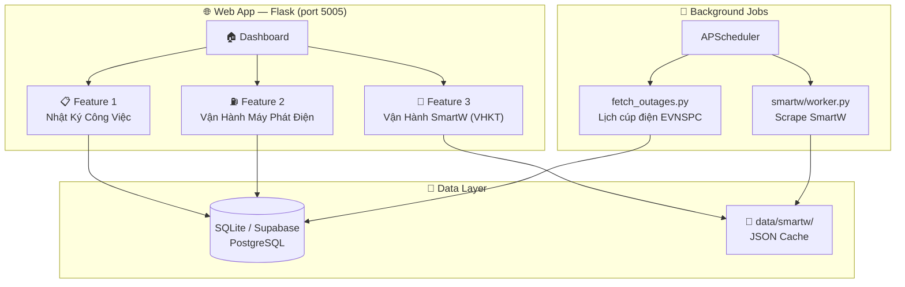
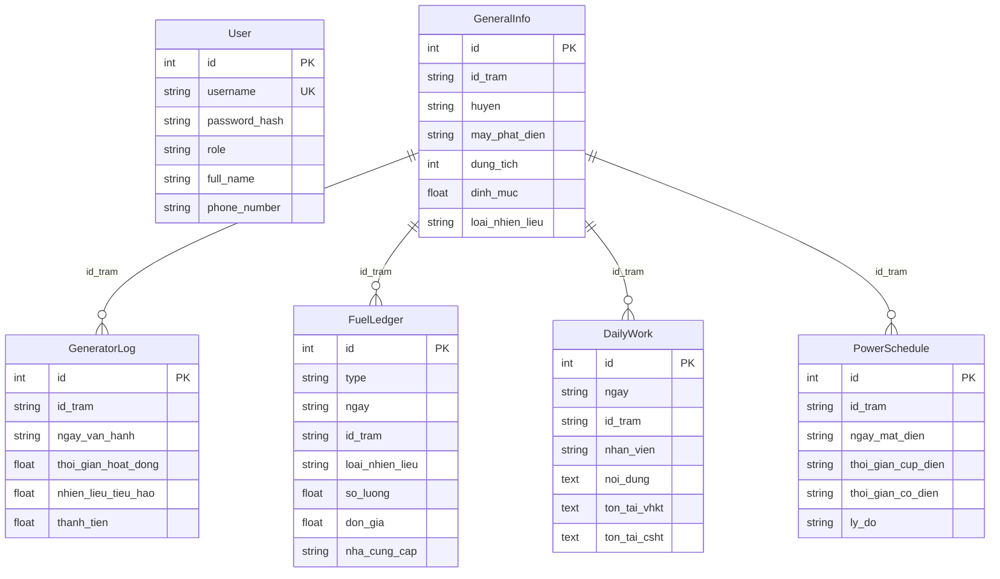

# System Architecture — Quản Lý Vận Hành Trạm VT3

**Cập nhật:** 13/02/2026  
**Version:** 2.0

---

## 1. TỔNG QUAN

Web Application nội bộ phục vụ **Tổ Viễn Thông 3 — MobiFone Đồng Nai**. Hệ thống giúp nhân viên quản lý toàn bộ hoạt động vận hành trạm viễn thông qua 3 chức năng chính.



---

## 2. BA CHỨC NĂNG CHÍNH

### Feature 1: Nhật Ký Công Việc Hàng Ngày
> **BRIEF:** [BRIEF_daily_work.md](file:///d:/download/VH%20may%20phat%20dien/docs/BRIEF_daily_work.md)

| Mục đích | Kiểm đếm công việc NV, theo dõi tồn tại VHKT/CSHT |
|----------|--------------------------------------------------|
| DB Models | `DailyWork` |
| Templates | `daily_work.html` |
| Routes | `/daily-work`, `/add-daily-work`, `/export-daily-work` |
| Users | Tất cả nhân viên Tổ VT3 |

### Feature 2: Vận Hành Máy Phát Điện
> **BRIEF:** [BRIEF_generator_operations.md](file:///d:/download/VH%20may%20phat%20dien/docs/BRIEF_generator_operations.md)

| Mục đích | Quản lý MPĐ, nhiên liệu, kho trung tâm, báo cáo KPI |
|----------|----------------------------------------------|
| DB Models | `GeneralInfo`, `GeneratorLog`, `FuelLedger`, `PowerSchedule`, `FuelRefillLog`*, `FuelPurchaseLog`*, `OtherExpense` |
| Templates | `generator_log.html`, `power_schedule.html`, `general_info.html`, `reports.html`, `index.html` (dashboard) |
| Routes | 50+ routes (CRUD, import/export, audit) |
| Background | `fetch_outages.py` — crawl EVNSPC lịch cúp điện (5 AM daily) |
| Users | NV (nhập) + Admin (báo cáo, audit) |

> *`FuelRefillLog`, `FuelPurchaseLog` = legacy, thay bằng `FuelLedger` từ 2026*

### Feature 3: Vận Hành SmartW (VHKT) — ✅ IMPLEMENTED
> **BRIEF:** [BRIEF_smartw_vhkt.md](file:///d:/download/VH%20may%20phat%20dien/docs/BRIEF_smartw_vhkt.md)

| Mục đích | Giám sát alarm MĐ/MPĐ/MLL realtime từ SmartW |
|----------|----------------------------------------------|
| Module | `smartw/` (Blueprint riêng) |
| Files | `scraper.py`, `worker.py`, `routes.py`, `config.py`, `mll_validator.py` |
| Templates | `vhkt.html` |
| Data | JSON files (`data/smartw/`) — KHÔNG lưu DB |
| APIs | `/api/smartw/{summary,md,mpd,mll,vhkt,trigger}` |
| Background | Alarm poll 5 phút + VHKT 7 AM |
| Users | NV hiện trường (mobile), Admin (cấu hình) |
| Status | ✅ Core hoạt động. 🔧 MLL auto-refresh flicker cần fix |

---

## 3. TECH STACK

| Layer | Technology |
|-------|-----------|
| **Frontend** | Tabler UI (Bootstrap 5), Jinja2 Templates, FontAwesome, vanilla JS |
| **Backend** | Python 3.x, Flask 3.x |
| **Database** | SQLite (dev) / PostgreSQL via Supabase (prod) |
| **ORM** | Flask-SQLAlchemy |
| **Scheduler** | Flask-APScheduler |
| **Scraping** | Playwright (headless Chromium) + Requests |
| **Security** | Fernet encryption (credentials), session auth, role-based access |
| **Deployment** | Local + Cloudflare Tunnel |

---

## 4. CẤU TRÚC THƯ MỤC

```
VH may phat dien/
├── docs/                          # 📚 Tài liệu dự án
│   ├── architecture/
│   │   └── system_overview.md     # ← FILE NÀY
│   ├── BRIEF_daily_work.md        # Brief Feature 1
│   ├── BRIEF_generator_operations.md # Brief Feature 2 (bao gồm NL tồn & báo cáo)
│   └── BRIEF_smartw_vhkt.md       # Brief Feature 3
│
├── plans/                         # 📋 Kế hoạch triển khai
│   └── 260213-1219-smartw-vhkt/   # Plan SmartW (7 phases)
│
├── web-app/                       # 🌐 Source code chính
│   ├── app.py                     # Routes chính (~2300 lines)
│   ├── models.py                  # DB Models (9 models)
│   ├── helpers.py                 # Business logic (stock, audit, KPI)
│   ├── extensions.py              # Flask extensions (db, scheduler)
│   ├── fetch_outages.py           # EVNSPC crawler
│   │
│   ├── smartw/                    # 📡 SmartW module (Blueprint)
│   │   ├── __init__.py
│   │   ├── scraper.py             # Playwright SSO login + 4 table scrapers
│   │   ├── worker.py              # Poll + clear detection
│   │   ├── routes.py              # API endpoints + admin controls
│   │   ├── config.py              # Fernet encryption
│   │   └── mll_validator.py       # MLL cause validation
│   │
│   ├── templates/                 # 🎨 Jinja2 Templates (15 files)
│   │   ├── layout.html            # Base template + nav
│   │   ├── index.html             # Dashboard
│   │   ├── daily_work.html
│   │   ├── generator_log.html
│   │   ├── power_schedule.html
│   │   ├── general_info.html
│   │   ├── reports.html
│   │   ├── vhkt.html              # SmartW monitoring
│   │   ├── admin_panel.html
│   │   └── ...
│   │
│   ├── data/smartw/               # JSON cache (gitignored)
│   └── instance/                  # SQLite DB file
```

---

## 5. DATABASE SCHEMA



---

## 6. PHÂN QUYỀN

| Role | Quyền |
|------|-------|
| **user** | Nhập daily work, xem bảng, export Excel |
| **admin** | Tất cả + quản lý users, duyệt xóa, access reports/audit, cấu hình SmartW |

---

## 7. BACKGROUND JOBS

| Job | Trigger | Nguồn | Output |
|-----|---------|-------|--------|
| Lịch cúp điện EVNSPC | Cron 5:00 AM | `fetch_outages.py` | DB `PowerSchedule` |
| SmartW Alarm Poll | Interval 5 min | `smartw/worker.py` | `data/smartw/*_active.json` |
| SmartW VHKT Poll | Cron 7:00 AM | `smartw/worker.py` | `data/smartw/vhkt_daily.json` |

---

## 8. DEPLOYMENT

```
                    ┌─────────────┐
                    │  Internet   │
                    └──────┬──────┘
                           │
                    ┌──────▼──────┐
                    │ Cloudflare  │
                    │   Tunnel    │
                    └──────┬──────┘
                           │
              ┌────────────▼────────────┐
              │  Local Machine (Win/Mac)│
              │  Flask :5005            │
              │  ├── SQLite (local)     │
              │  └── Supabase (cloud)   │
              └─────────────────────────┘
```
