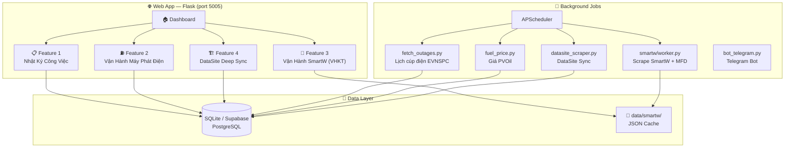
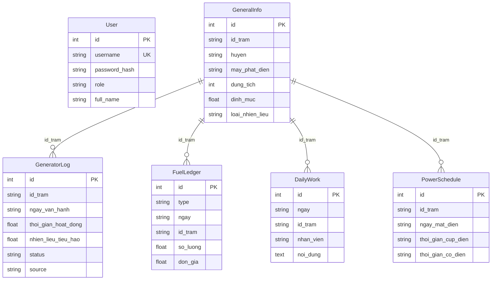

# System Architecture — Quản Lý Vận Hành Trạm VT3

**Cập nhật:** 13/03/2026  
**Version:** 4.0

---

## 1. TỔNG QUAN

Web Application nội bộ phục vụ **Tổ Viễn Thông 3 — MobiFone Đồng Nai**. Hệ thống giúp nhân viên quản lý toàn bộ hoạt động vận hành trạm viễn thông qua 4 chức năng chính.



---

## 2. BA CHỨC NĂNG CHÍNH

### Feature 1: Nhật Ký Công Việc Hàng Ngày
> **BRIEF:** [BRIEF_daily_work.md](file:///d:/download/VH%20may%20phat%20dien/docs/BRIEF_daily_work.md)

| Mục đích | Kiểm đếm công việc NV, theo dõi tồn tại VHKT/CSHT |
|----------|--------------------------------------------------|
| DB Models | `DailyWork` |
| Templates | `daily_work.html` |
| Routes | `/daily-work`, `/add-daily-work`, `/export-daily-work` |
| Users | Tất cả nhân viên Tổ VT3 |

### Feature 2: Vận Hành Máy Phát Điện
> **BRIEF:** [BRIEF_generator_operations.md](file:///d:/download/VH%20may%20phat%20dien/docs/BRIEF_generator_operations.md)

| Mục đích | Quản lý MPĐ, nhiên liệu, kho trung tâm, báo cáo KPI |
|----------|----------------------------------------------|
| DB Models | `GeneralInfo`, `GeneratorLog`, `FuelLedger`, `PowerSchedule`, `FuelRefillLog`*, `FuelPurchaseLog`*, `OtherExpense` |
| Templates | `generator_log.html`, `power_schedule.html`, `general_info.html`, `reports.html`, `index.html` (dashboard) |
| Routes | 50+ routes (CRUD, import/export, audit) |
| Background | `fetch_outages.py` — crawl EVNSPC lịch cúp điện (5 AM daily) |
| Users | NV (nhập) + Admin (báo cáo, audit) |

> *`FuelRefillLog`, `FuelPurchaseLog` = legacy, thay bằng `FuelLedger` từ 2026*

### Feature 3: Vận Hành SmartW (VHKT) — ✅ IMPLEMENTED
> **BRIEF:** [BRIEF_smartw_vhkt.md](file:///d:/download/VH%20may%20phat%20dien/docs/BRIEF_smartw_vhkt.md)

| Mục đích | Giám sát alarm MĐ/MPĐ/MLL realtime từ SmartW |
|----------|----------------------------------------------|
| Module | `smartw/` (Blueprint riêng) |
| Files | `scraper.py`, `worker.py`, `routes.py`, `config.py`, `mll_validator.py` |
| Templates | `vhkt.html` |
| Data | JSON files (`data/smartw/`) — KHÔNG lưu DB |
| APIs | `/api/smartw/{summary,md,mpd,mll,vhkt,trigger}` |
| Background | Alarm poll 5 phút + VHKT 7 AM |
| Users | NV hiện trường (mobile), Admin (cấu hình) |
| Status | ✅ Core hoạt động. 🔧 MLL auto-refresh flicker cần fix |

### Feature 4: DataSite Deep Sync — ✅ IMPLEMENTED

| Mục đích | Sync tài sản trạm từ DataSite Excel (15 loại đối tượng → 5 nhóm DB) |
|----------|----------------------------------------------|
| Module | `datasite_sync_config.py`, `datasite_scraper.py`, `datasite_routes.py` |
| DB Models | `DsStation`, `DsContract`, `DsInfrastructure`, `DsEquipment`, `DsTelecom`, `DataSiteAnomaly` |
| Templates | `datasite/datasite_dashboard.html` |
| Routes | `/datasite/*` |
| Background | Weekly auto-sync Sunday 2 AM |
| Config | `EXPORT_OBJECT_MAP` — 15 export types with column mapping |
| Status | ✅ Deep Sync hoạt động. Legacy `DataSiteAsset` chờ xóa |

---

## 3. TECH STACK

| Layer | Technology |
|-------|-----------|
| **Frontend** | Tabler UI (Bootstrap 5), Jinja2 Templates, FontAwesome, vanilla JS |
| **Backend** | Python 3.x, Flask 3.x |
| **Database** | SQLite (dev) / PostgreSQL via Supabase (prod) |
| **ORM** | Flask-SQLAlchemy |
| **Scheduler** | Flask-APScheduler |
| **Scraping** | Playwright (headless Chromium) + Requests |
| **Security** | Fernet encryption (credentials), session auth, role-based access |
| **Deployment** | Local + Cloudflare Tunnel |

---

## 4. CẤU TRÚC THƯ MỤC

```
VH may phat dien/
├── docs/                          # 📚 Tài liệu dự án
│   ├── architecture/
│   │   └── system_overview.md     # ← FILE NÀY
│   ├── BRIEF_daily_work.md        # Brief Feature 1
│   ├── BRIEF_generator_operations.md # Brief Feature 2 (bao gồm NL tồn & báo cáo)
│   └── BRIEF_smartw_vhkt.md       # Brief Feature 3
│
├── plans/                         # 📋 Kế hoạch triển khai
│   └── 260213-1219-smartw-vhkt/   # Plan SmartW (7 phases)
│
├── web-app/                       # 🌐 Source code chính
│   ├── app.py                     # App entry + blueprint registration
│   ├── models.py                  # DB Models (18 models, 5 DataSite groups)
│   ├── helpers.py                 # Business logic (stock, audit, KPI)
│   ├── extensions.py              # Flask extensions (db, scheduler)
│   ├── fetch_outages.py           # EVNSPC crawler
│   ├── fuel_price.py              # PVOil price scraper
│   ├── bot_telegram.py            # Telegram Bot polling
│   ├── datasite_scraper.py        # DataSite Excel scraper
│   ├── datasite_sync_config.py    # EXPORT_OBJECT_MAP (15 types → 5 groups)
│   ├── datasite_routes.py         # DataSite API routes
│   │
│   ├── smartw/                    # 📡 SmartW module (Blueprint)
│   │   ├── scraper.py             # Playwright SSO login + 4 table scrapers
│   │   ├── worker.py              # Poll + MFD import + clear detection
│   │   ├── routes.py              # API endpoints + admin controls
│   │   ├── config.py              # Fernet encryption
│   │   └── mll_validator.py       # MLL cause validation
│   │
│   ├── generator/                 # ⛽ Generator module (Blueprint)
│   │   ├── routes.py              # CRUD + import/export
│   │   └── mfd_import.py          # MFD SmartW auto-import + overnight
│   │
│   ├── daily_work/                # 📋 Daily Work module (Blueprint)
│   ├── core/                      # 🔧 Core routes (Blueprint)
│   │
│   ├── templates/                 # 🎨 Jinja2 Templates (20+ files)
│   │   ├── layout.html            # Base template + nav
│   │   ├── daily_work.html
│   │   ├── vhkt.html              # SmartW monitoring
│   │   ├── admin_panel.html
│   │   ├── datasite/              # DataSite dashboard
│   │   ├── partials/              # Tab components
│   │   └── ...
│   │
│   ├── data/smartw/               # JSON cache (gitignored)
│   └── instance/                  # SQLite DB file
```

---

## 5. DATABASE SCHEMA

### 5.1. Core Models



### 5.2. DataSite Models (5 Nhóm - v2)

| Nhóm | Model | Table | Mô tả |
|------|-------|-------|---------|
| 1. Thông Tin Chung | `DsStation` | `ds_stations` | Thông tin trạm |
| 1. Thông Tin Chung | `DsContract` | `ds_contracts` | Hợp đồng thuê trạm nhà dân |
| 2. Cơ Sở Hạ Tầng | `DsInfrastructure` | `ds_infrastructure` | Cột Anten, Phòng Máy, Nhà Trạm |
| 3. Phụ Trợ | `DsEquipment` | `ds_equipments` | MPĐ, Rectifier, Accu, Solar, Quạt, PCCC, SPD |
| 4. Kỹ Thuật | `DsTelecom` | `ds_telecom` | BTS 2G/3G/4G/5G, Truyền dẫn, Repeater |
| 5. Cross-Check | `DataSiteAnomaly` | `datasite_anomalies` | Bắt lỗi dữ liệu |

---

## 6. PHÂN QUYỀN

| Role | Quyền |
|------|-------|
| **user** | Nhập daily work, xem bảng, export Excel |
| **admin** | Tất cả + quản lý users, duyệt xóa, access reports/audit, cấu hình SmartW |

---

## 7. BACKGROUND JOBS

| Job | Trigger | Nguồn | Output |
|-----|---------|-------|--------|
| Lịch cúp điện EVNSPC | Cron 5:00 AM | `fetch_outages.py` | DB `PowerSchedule` |
| SmartW Alarm Poll | Interval 15 min | `smartw/worker.py` | `data/smartw/*_active.json` |
| SmartW VHKT Poll | Cron 5:00 AM | `smartw/worker.py` | `data/smartw/vhkt_daily.json` |
| MFD Auto-Import | Cron 6:00 AM | `generator/mfd_import.py` | DB `GeneratorLog` |
| Fuel Price Scrape | Cron 4:00 PM | `fuel_price.py` | DB giá PVOil |
| DataSite Sync | Cron Sun 2:00 AM | `datasite_scraper.py` | DB DataSite 5 nhóm |
| Telegram Bot | Thread (startup) | `bot_telegram.py` | Telegram notifications |

---

## 8. DEPLOYMENT

```
                    ┌─────────────┐
                    │  Internet   │
                    └──────┬──────┘
                           │
                    ┌──────▼──────┐
                    │ Cloudflare  │
                    │   Tunnel    │
                    └──────┬──────┘
                           │
              ┌────────────▼────────────┐
              │  Local Machine (Win/Mac)│
              │  Flask :5005            │
              │  ├── SQLite (local)     │
              │  └── Supabase (cloud)   │
              └─────────────────────────┘
```
