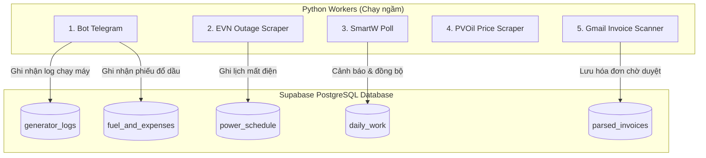
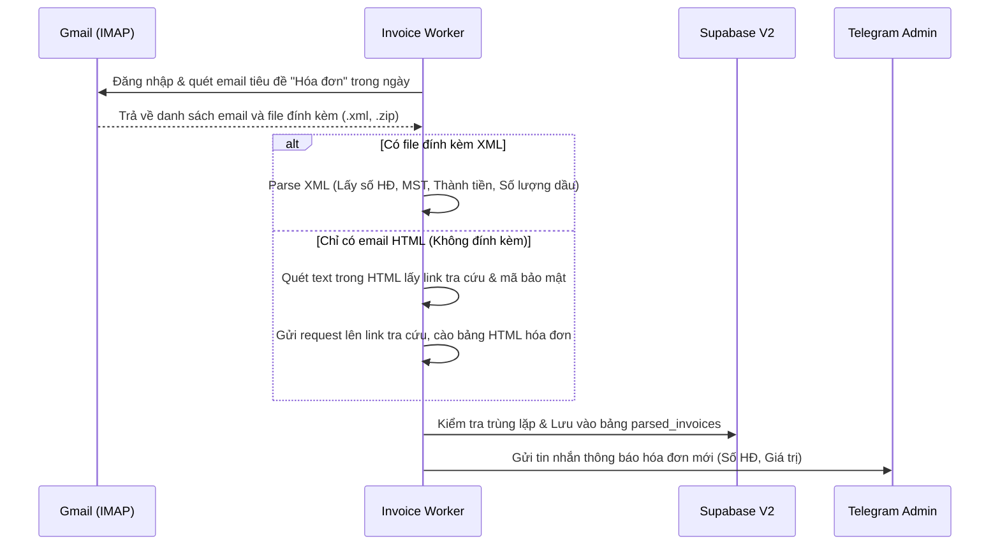

# 🎨 DESIGN: Thiết Kế Chi Tiết Hệ Thống Workers V2 (Kiến Trúc & Luồng Dữ Liệu)

Ngày tạo: 2026-06-16  
Dựa trên kế hoạch: [plan.md](file:///Users/cang_it/Antigravity/TVT3/plans/260616-1013-backend-migration-v2/plan.md) và [BRIEF_BACKEND_MIGRATION_V2.md](file:///Users/cang_it/Antigravity/TVT3/docs/BRIEF_BACKEND_MIGRATION_V2.md)

---

## 1. Cách Lưu Trữ & Tương Tác Dữ Liệu (Database V2)

Thay vì thông qua server trung gian Flask, tất cả các Python Workers của V2 sẽ nói chuyện trực tiếp với **Supabase PostgreSQL** thông qua thư viện `supabase-py` sử dụng kết nối bảo mật HTTPS.

### 📦 Sơ đồ tương tác dữ liệu:

### 🗝️ Logic Tạo Khóa Chính Tự Sinh Xác Định (Idempotent UUIDs)
Để triệt tiêu lỗi trùng lặp dữ liệu khi chạy lại tiến trình hoặc cào đè, khóa chính (`UUID`) của bản ghi mới được tạo bằng hàm băm xác định:
*   **Nhật ký chạy máy (generator_logs)**:  
    `gen_log_id = uuid.uuid5(uuid.NAMESPACE_OID, f"generator_log_{site_id}_{ngay_van_hanh}_{gio_bat_dau}")`
*   **Giao dịch nhiên liệu (fuel_and_expenses)**:  
    `record_id = uuid.uuid5(uuid.NAMESPACE_OID, f"fuel_ledger_{site_id}_{ngay_giao_dich}_{loai_giao_dich}_{so_luong}")`
*   **Hóa đơn điện tử (parsed_invoices)**:  
    `invoice_id = uuid.uuid5(uuid.NAMESPACE_OID, f"parsed_invoice_{so_hoa_don}_{mst_nguoiban}")`

---

## 2. Chi Tiết Các Cấu Phần (Workers)

### 🤖 2.1. Telegram Bot (`bot_telegram.py`)
*   **Vai trò**: Nhận tin nhắn/lệnh từ kỹ thuật viên trên Telegram, phân tích cú pháp để lưu thông tin vận hành.
*   **Lệnh hỗ trợ**:
    *   `/start`: Đăng ký tài khoản (lưu `chat_id` và phân quyền).
    *   `/log <site_id> <chay_may>`: Ghi nhận nhật ký chạy máy phát điện.
    *   `/refill <site_id> <so_luong>`: Ghi nhận phiếu mua/đổ dầu trực tiếp.
    *   `/stock <site_id> <ton_thuc_te>`: Ghi nhận phiếu hiệu chỉnh tồn kho dầu tại trạm.

### 🔌 2.2. EVN Outage Scraper (`fetch_outages.py`)
*   **Vai trò**: Định kỳ cào danh sách lịch cúp điện từ EVN SPC theo danh sách mã PE của các trạm.
*   **Quy trình**:
    1. Đọc danh sách mã PE (`ma_pe`) hợp lệ từ bảng `datasites`.
    2. Cào cổng EVN SPC bằng `requests` API.
    3. Đẩy dữ liệu vào bảng `power_schedule` (sử dụng ràng buộc `UNIQUE` trên bộ ba `site_id`, `date`, `start_time` để tránh trùng lặp).

### 🧾 2.3. Gmail Invoice Scanner (`invoice_worker.py`)
*   **Vai trò**: Đọc tự động các email thông báo hóa đơn mua xăng dầu từ Gmail của Admin, giải nén file ZIP, đọc file XML và lưu trữ vào Supabase.
*   **Quy trình**:

---

## 3. Checklist Kiểm Tra Điều Kiện Hoàn Thành (Acceptance Criteria)

### 📋 Checklist 1: Telegram Bot hoạt động trên V2
- [ ] Khởi chạy bot qua `bot_telegram.py` kết nối trực tiếp với Supabase V2 không qua Flask.
- [ ] Kỹ thuật viên gửi tin nhắn ghi nhận chạy máy -> Supabase ghi nhận thành công, sinh UUID xác định.
- [ ] Gửi trùng tin nhắn chạy máy -> Supabase thực hiện `upsert` đè, không sinh dòng mới.

### 📋 Checklist 2: Quét hóa đơn tự động (Gmail Scanner)
- [ ] Kết nối IMAP Gmail thành công bằng mật khẩu ứng dụng.
- [ ] Nhận biết và tải đúng các tệp XML đính kèm hoặc tệp ZIP (tự giải nén lấy XML).
- [ ] Đọc đúng các chỉ số: Số lượng lít dầu, đơn giá, tổng tiền của PVOil/Petrolimex.
- [ ] Đồng bộ hóa đơn vào Supabase V2 trạng thái `Pending` (Chờ duyệt).
- [ ] Gửi thông tin thông báo chính xác lên Telegram nhóm Admin.

---

## 4. Thiết Kế Bài Kiểm Thử (Test Cases)

### 🧪 TC-01: Kiểm tra tính Idempotent khi chạy lại Scraper mất điện
*   **Given**: Bảng `power_schedule` đã có lịch mất điện của trạm `DNISRA01` vào ngày `2026-06-20` lúc `08:00`.
*   **When**: Chạy lệnh `python backend/fetch_outages.py` quét lại lịch ngày `2026-06-20`.
*   **Then**: Lịch quét được từ EVN không chèn thêm dòng mới vào bảng `power_schedule` (số lượng bản ghi giữ nguyên).

### 🧪 TC-02: Quét Gmail phát hiện hóa đơn mua dầu thực tế
*   **Given**: Có 1 email mới gửi tới hòm thư có tiêu đề "Hóa đơn giá trị gia tăng Điện tử 1C26MTP" chứa file đính kèm `.zip`.
*   **When**: Chạy lệnh `python backend/invoice_worker.py`.
*   **Then**:
    *   Hệ thống đọc email, giải nén lấy file XML bên trong.
    *   Lưu hóa đơn vào Supabase V2 thành công với mã UUID dạng: `uuid.uuid5(uuid.NAMESPACE_OID, "parsed_invoice_393272_3600642702")`.
    *   Bot Telegram gửi thông báo chi tiết hóa đơn: Số HĐ `393272`, Giá trị `691,250 đ`.
